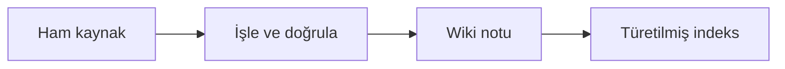

# Obsidian Vault Önerisi (şifreli repo)

Bu depo, git-crypt kilidi açık bir makinede Obsidian vault'u olarak açılabilir.
Amaç: şifreli notları düz metin olarak gezinmek — Obsidian bir veritabanı
kopyası değildir, `wiki/` markdown'ı kanonik gerçektir.

## Ön koşul: kilit açık olmalı
Şifreli yollar (`index.md`, `index/`, `raw/`, `wiki/`, `log/`, `plans/`,
`agent/prompts/`, `agent/sessions/`) yalnız `git-crypt unlock` sonrası metin
olarak çözülür. Vault'u kilitli klonda açmak **binary gürültü** verir: notlar
okunamaz, arama boş döner, wikilink'ler kırık görünür. Bu bir bozulma
değildir. Çözüm vault'ta değil klondadır:

```bash
git-crypt unlock /guvenli/yer/noma.key
git status   # şifreli yolların düz metne döndüğünü doğrula
```

Kilidi kapatırsan aynı binary duruma dönersin; vault'u kapatıp yeniden açmak
sorunu çözmez.

## Commit edilmemesi gerekenler
`.obsidian/` (çalışma dosyaları, cache) ve `.trash/` repoya girmez — kök
`.gitignore` bunları zaten kapsar. Yeni dosya eklersen de "add all" kullanma;
`git add -p` ile yalnız not dosyalarını stage et. Vault ayarlarını kişisel
veriyle (anahtar yolu, hesap adı) doldurma.

## Önerilen ignore filtreleri (vault içi)
Obsidian'ın "Excluded files" listesine şunları ekle — arama ve grafik
gürültüsünü keser, gövde bozulmaz:

- `tmp/` — geçici işler, commit edilmez (`.gitignore` kapsamında)
- `plans/` — görev durumu, tek oturuma özel
- `log/` — günlük `YYYY-MM-DD.md` kayıtları; append-only, aramaya gerekmez
- `raw/` — kaynak klipleri; aramak wiki notlarını kirletir

Filtreleri vault'ta uygula, `.gitignore`'a ekleme: log/plan/ham içerik repoda
tutulur, yalnız günlük gezinmeden çıkarılır.

## Sert kural — anahtar materyali
`noma.key`, `git-crypt` passphrase'i, `.env` veya herhangi bir API anahtarı
vault'a, eklenti ayarına, plugin veritabanına veya Obsidian cache'ine
girmez. Anahtar yalnız `git-crypt unlock` çağrısında, disk üzerinde
saklanır. Şifreli wiki'yi okuyabilen bir eklenti zaten tam yetkilidir; yeni
eklenti eklemeden önce "bu eklenti şifreli içeriği dışarı taşıyor mu" sorusu
sorulur. Üçüncü taraf sync/backup eklentileri varsayılan kapalıdır.

## Vault'ta ne yapılır
- Gezinme kökü `index.md`; hub haritaları `index/hubs/` (sayfalı, şifreli).
- Not okurken `## Summary` → `## Links` → yalnız gereken gövde bölümü sırası.
- `wiki/` dışına (public dizinler) kişisel veri yazılmaz.
- Doğrulama/derleme turları Obsidian'dan değil `scripts/` CLI'dan koşar.

## İsteğe bağlı Mermaid diyagramları
Akış, ilişki veya karar dallarını anlamayı kolaylaştırıyorsa notun gövdesine
`mermaid` kod bloğu koy. Diyagramın ne anlattığını bir cümleyle de yaz; düz
Markdown okuyan agent için metin, görsel önizleme kullanan insan için diyagram
birbirini tamamlar. `## Links` düz wikilink listesi ve `## Summary` kısa metin
olarak kalır. Diyagram içindeki yazılar notlar arası bağlantının yerini almaz.

````markdown
## Akış
Ham kaynaktan işlenen bilgi wiki notunda yaşar; gezinme haritası ondan üretilir.


````

Yalnız diyagram açıklamadan daha yararlıysa ekle; her nota boş diyagram veya yeni
frontmatter alanı koyma. Sözdizimi ve Obsidian önizlemesi: [Obsidian Mermaid
yardımı](https://help.obsidian.md/advanced-syntax#Diagram).
